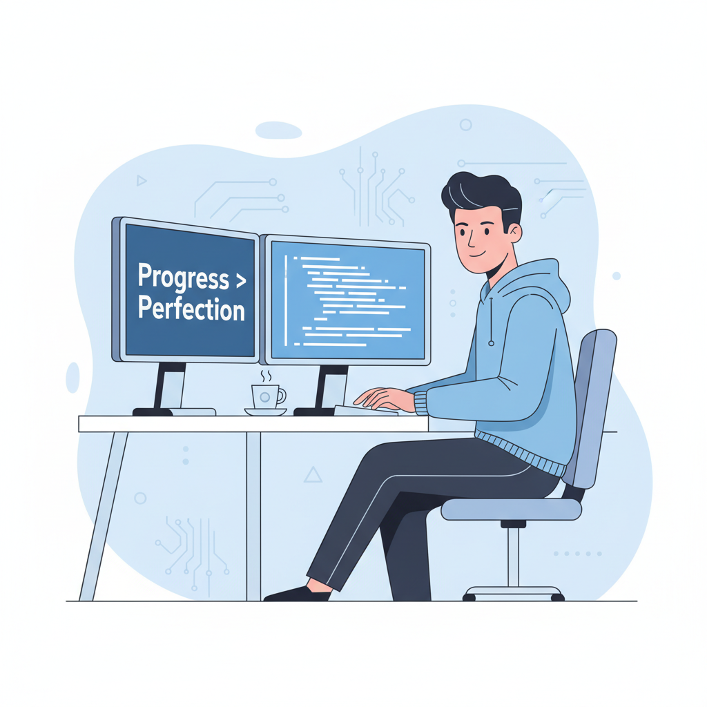

<h1 align="center">
  
</h1>

---

## 🚀 About Me

<table>
  <tr>
    <!-- Left Column: Image Slider -->
    <td width="45%" valign="top" align="center">
      

        
        
        
      

      
Scroll horizontally →

    </td>

    <!-- Right Column: About Me -->
    <td width="55%" valign="top">
      <h2>🚀 About Me</h2>
      

        Hello! I'm <b>SD NATH</b>, a passionate MERN stack developer. My programming journey started 
        with curiosity about the web, and since then, I've been crafting dynamic web apps using 
        <b>JavaScript, React, Node.js, Express.js, and MongoDB</b>.  
        I enjoy building interactive, user-friendly interfaces and solving complex problems with creative solutions.
        Continuous learning is my fuel.
      

      

        <b>🖥️ Programming & Web Development</b> &nbsp;&nbsp; <b>🎨 Painting</b>  
        <b>🥾 Hiking & Outdoors</b>
      

      
<i>"I believe creativity and technical skills combined can build inspiring solutions that make a difference."</i>

    </td>
  </tr>
</table>

---

## 📌 Current Activities
- 🚀 Exploring **Next.js** and its ecosystem.
- 🏞️  Developing a **Blood Donation Website** project.
- 📊 Implementing advanced **data visualizations** with Chart.js.
- 🌱 Enhancing UI/UX in my **Food Sharing** project.

---

## 🛠️ Skills

**Frontend**
 

**Backend & Database**
 

**Tools & Deployment**
 

---

## 🌐 Social Links

  
  
  

---

## 📊 GitHub Metrics

<!-- GitHub Stats -->
  

<!-- Streak Stats -->
  

<!-- Top Languages -->
  

<!-- Profile Summary -->
  

